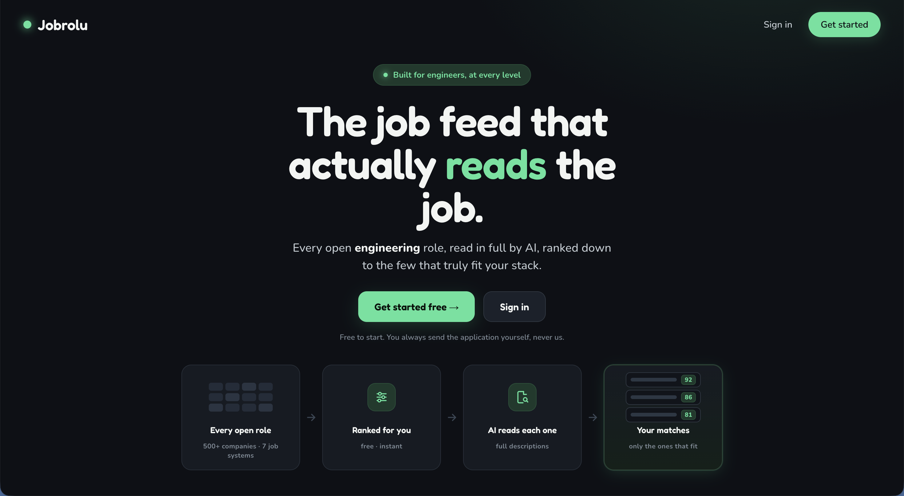
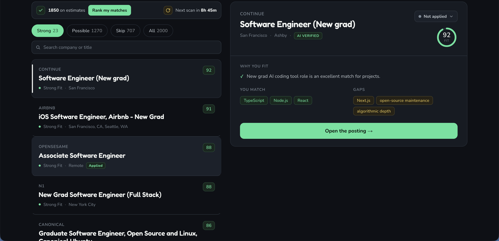
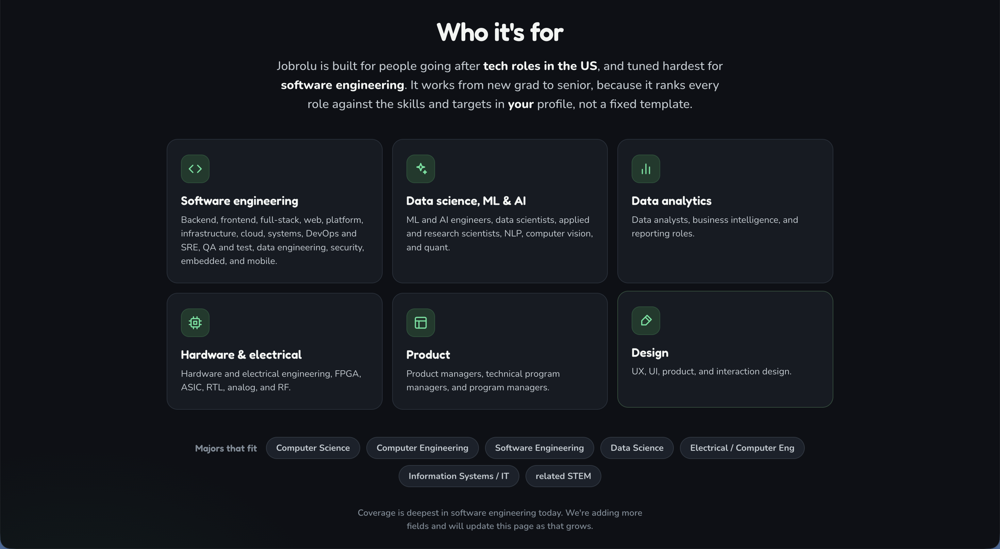
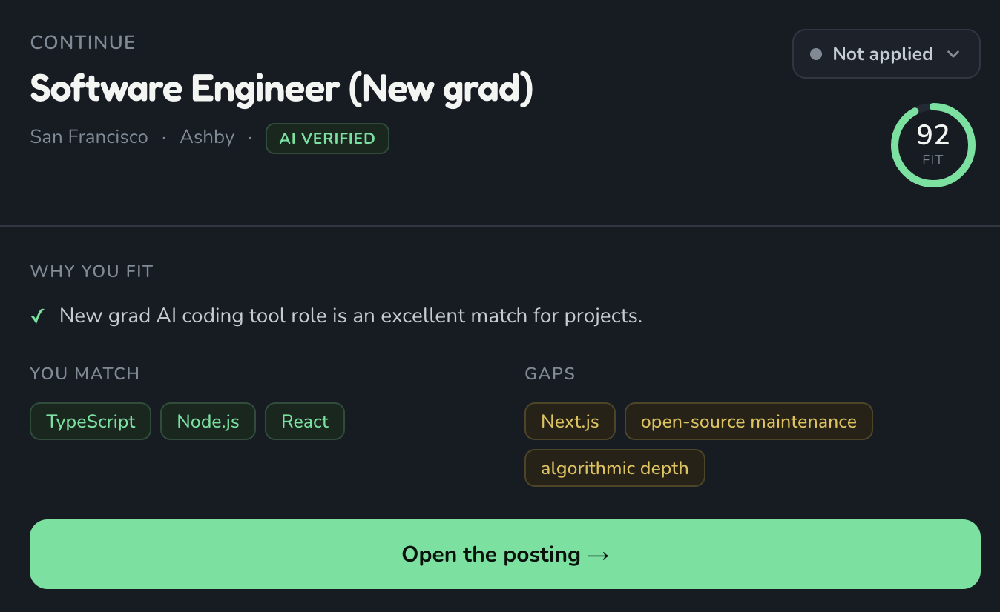
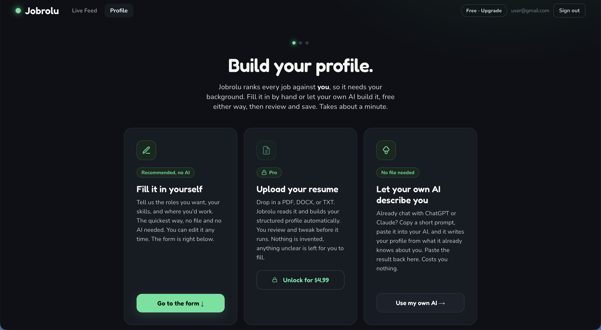
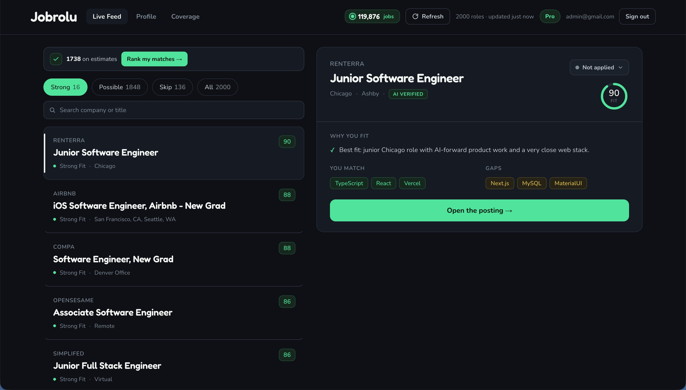
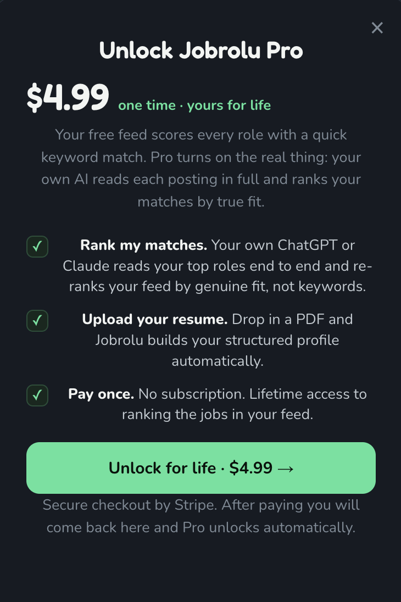

<div align="center">

# 🎯 Jobrolu

### Stop spraying applications. Find the roles that actually fit, and the human to email.

[](https://www.jobrolu.com)

     

**One profile. Thousands of live roles. Ranked honestly, with the recruiter's email attached.**

**🌐 Live at [www.jobrolu.com](https://www.jobrolu.com)**

<br>



</div>

---

## ✨ What it is

Most job tools either autofill the same form a hundred times, or dump a feed of loosely-matched listings on you. Neither tells you which roles are actually worth your time, or who to talk to.

Jobrolu runs the search the way it actually works: **aggregate** from clean sources, **rank** every role honestly against a real profile, and **hand you the recruiter** to email with a personalized draft. You always do the final send. No spammy auto-apply, no hallucinated matches.

**You make an account first.** Jobrolu ranks against *you*, so you sign up, build a profile (a quick form, a resume, or your own AI), and a feed of the live job pool ranked for you unlocks. Everyone has an equal account; each person gets their own profile and their own ranked feed.

<p align="center">
  
  <br>
  <sub><i>The live feed: the shared pool ranked against your profile, split into Strong, Possible, and Skip, each with an AI-verified fit score and the reasons behind it. Cards show salary where the source states it and how recently the role was posted, and the list can be sorted by best match, most recent, or highest pay.</i></sub>
</p>

---

## 👤 Who it's for

Jobrolu is built for people going after **tech roles in the US**, and tuned hardest for **software engineering**. It works from new grad to senior, because every role is ranked against the skills and targets in *your* profile, not a fixed template. The shared pool is broad and each person's feed is narrowed to their own discipline, level, and location, so one account fits a backend new grad and a senior SRE alike. A built-in **multi-field mode**, on by default (set `MULTIFIELD=off` to disable), extends the exact same engine to professional, resume-driven roles in other fields, so the product can serve anyone whose job search runs on a resume.

It covers software engineering (backend, frontend, full-stack, web, platform, infrastructure, cloud, systems, DevOps and SRE, QA, data engineering, security, embedded, mobile), data science / ML / AI, data analytics, hardware and electrical, product, and design. Best-matched majors are Computer Science, Computer / Software / Electrical Engineering, Data Science, Information Systems, and related STEM. Coverage is deepest in software engineering today and widens over time. With multi-field mode on, it also covers finance and accounting, marketing and communications, sales and business development, HR and recruiting, operations and supply chain, legal, professional healthcare (nursing, pharmacy, therapy, and similar), education, consulting, project and program management, and other white-collar fields, while deliberately leaving out hourly and manual roles where a resume and an AI fit-read add little.

<p align="center">
  
</p>

---

## 🧠 How it works (the funnel)

The whole design exists to keep cost near zero while still using AI where it matters. Jobs flow through stages, and **only one stage costs money**.

```
  resume / profile            (onboard.py: PDF/DOCX, even scanned -> structured JSON via one cheap LLM call)
        |
        v
  SOURCING                    7 ATS APIs + Adzuna + USAJOBS + two curated new-grad
        |                     lists, self-growing registry. 126,000+ roles, 7,000+
        |                     companies, all from clean ToS-friendly sources.    $0
        v
  PREFILTER                   free, rule-based. Keeps on-target titles (tech by default,
        |                     professional fields in multi-field mode); scoring narrows.   $0
        v
  FREE HEURISTIC SCORE        score.py rates EVERY job against YOUR profile: title fit
        |                     (dominant), your skills, seniority matched to your own
        |                     level, location. Works for any resume. Ranks best-first.    $0
        v
  AI FIT-RANK (top N only)    sends only the top N to the LLM, which reads the FULL
        |                     posting and scores the real fit. Free in-app via your own
        |                     AI ("Rank my matches", top 150); paid via TOP_N.    ~$1+ paid run
        v
  CACHE                       jobcache.py remembers every AI ranking, so re-runs only
        |                     pay for genuinely new jobs.                          near $0 after
        v
  ENRICH + DRAFT              strong matches get a one-click LinkedIn recruiter search
        |                     and a personalized outreach email (cached).
        v
  FEED                        app.html: sign in, then browse YOUR ranked feed,
                              filter, search, verify with your own AI, copy the draft.
                              First load is two-phase: your field-relevant matches
                              score and show in seconds, then the rest of the pool
                              fills in from a background thread (identical scores).
```

---

## 🏷️ How ranking works, and what the scores mean

**This is the most important thing to understand, because two different systems produce the numbers you see.**

There are two scorers, and they are NOT on the same scale:

1. **The free heuristic scorer** (`score.py`) reads keywords, the job title, seniority words, and location. It is fast and free, and it runs on *every* job. It is a rough guess. It can give a high number to a job just because the title looks right ("Graduate Software Engineer" scores high on the new-grad and SWE-title signals even if zero of your skills appear in the text).

2. **The AI fit-ranker** (`rank.py`) reads the *full job description* against your profile and produces a careful, considered score with real reasons, gaps, and disqualifiers. Only the top N jobs (default 100) ever reach this step, because it is the only paid step.

Both scorers are field-agnostic by design: the same engine ranks a nurse, a teacher, an accountant, a marketer, or a backend engineer against their own background, with no per-field rules hand-tuned to favor one over another. This is checked by a cross-field test that runs a dozen real resumes from different fields against a tagged job pool and confirms, for every field, that the person's own roles rise to the top while roles from other fields fall away.

<p align="center">
  
  <br>
  <sub><i>An AI-verified match: a fit score, why you fit, the skills you match, and the gaps, all read from the full posting.</i></sub>
</p>

### The three tiers

| Tier | Who decided it | What it means |
|---|---|---|
| 🟢 **Strong** | The AI only | The AI read the full posting and confirmed a strong fit. Trustworthy. The heuristic can **never** award Strong. |
| 🟡 **Possible** | AI *or* heuristic | Either the AI judged it a moderate fit, or it only passed the free keyword pre-filter and the AI has not read it yet. |
| ⚪ **Skip** | AI *or* heuristic | Clear non-fit (seniority, clearance, wrong role), or a low heuristic score. |

### Why a "Possible" can show a higher number than a "Strong" (and why that is correct)

You will sometimes see a Possible job at, say, **78** sitting above a Strong job at **72**. That is expected, not a bug:

- The **78** is the *free heuristic's* unverified estimate. The AI never read that job.
- The **72** is the *AI's* verified verdict after reading the full posting.

A verified 72 is worth more than an unverified 78. They measure different things. To make this obvious, the UI marks the difference:

- **AI-verified** scores show in solid color with an **"AI verified"** tag and a `FIT` ring.
- **Estimated** (heuristic, not yet read by the AI) scores show muted, prefixed with a `~`, with an **"Estimate only"** tag and an `EST` ring.

So a green `88` with "AI verified" is a real judgment. A grey `~78` with "Estimate only" is a hunch to be confirmed.

### Turning estimates into verified scores

The free pass ranks the whole pool, but only your top matches are AI-read, and a genuinely good role with a plain or unusual title can sit lower until an AI reads it. Two ways to verify:

- **Bring-your-own-AI, right in the app (free).** On your feed, **Rank my matches** hands you a ready-made prompt covering your top 150 roles, each with its full description, to paste into your own ChatGPT or Claude. Paste the JSON back and those roles become verified fits, stored as yours, for **$0**. (The `export_rank.py` / `import_rank.py` CLI does the same from the command line.)
- **`TOP_N`** for a paid command-line run that reads deeper into the pool (see the cost model below).

---

## 💸 Cost model

Only the AI fit-rank step costs money. Everything else (sourcing, prefilter, heuristic scoring, hydration, the LinkedIn recruiter search) is plain HTTP and free.

| Scan depth | Jobs the AI reads | First run | Re-run (cache) |
|---|---|---|---|
| 100 (default) | top 100 | ~$1 | ~$0 |
| 300 | top 300 | ~$2-3 | ~$0 |
| 800 (deep sweep) | top 800 | ~$8 | ~$0 |
| Rank my matches | top 150, your own AI | **$0** | $0 |

In the app, the free **Rank my matches** flow (your own AI, top 150) costs **$0** and is the default way to verify. Paid depths above are set with `TOP_N` on the host for deeper command-line sweeps. The **cache** makes repeats free: a job already AI-read is never paid for again, so a re-run only pays for genuinely new jobs. The server hard-caps any single run at 2000 jobs as a backstop, and an Anthropic spend cap is the final ceiling.

The **cache** (`jobcache.py`) is what keeps it cheap: each posting has a stable id, and once the AI ranks it, the result is reused forever. Re-runs only pay for jobs that are genuinely new since last time.

Resume parsing on profile upload is one small LLM call (cents). It reads even scanned/image-only PDFs, and infers your likely target roles and location from your experience, which you review and edit before saving. Outreach drafts for strong matches are cents and are also cached.

---

## 🔐 Accounts and budget protection

Everyone has an equal account; there is no special owner tier. The model is simple:

- **Create an account, then build a profile.** Sign up with an email and password, then build your profile (a quick form, a resume upload, or letting your own AI describe you). The feed is gated: you must be signed in, and you need a profile, so nobody lands on a wall of unranked jobs or sees someone else's scores.
- **Sign in and sign out.** Passwords are hashed (PBKDF2-HMAC-SHA256, stdlib, no extra dependency) with a per-user salt and verified in constant time; the session is a signed, HttpOnly cookie. A profile built before signing up is kept, but a second account created on the same browser gets its own identity, so accounts never overwrite each other and one account never sees another's profile.
- **Your feed is yours.** Once you have a profile, you see the shared job pool ranked for *you* by the free heuristic, plus any roles you have personally verified. New jobs show as estimates until you verify them.
- **Verifying is free for everyone.** **Rank my matches** turns your top 150 roles into verified fits using your own ChatGPT or Claude, at no cost; it sends each role's full description so the AI judges the complete posting. Those verified rankings are stored against your profile and overlay your feed. Resume upload is open to every signed-in account.
- **The job pool refreshes itself.** New roles are pulled and heuristic-ranked automatically on a schedule (free, no AI), so the feed stays current on its own; the app shows a live countdown to the next scan. Any action that spends the deployment's API budget stays behind the access code, and a spend cap in the Anthropic console is the hard ceiling.
- **The shared pool is durable.** Each Refresh writes the resulting pool to Postgres, not just the host's disk, so a redeploy never reverts it. The feed reads the pool from Postgres (falling back to the committed file when the database is empty or off) and caches it in memory, so it is not re-parsed on every request. The pool is stored split across rows so it can grow without hitting any single-value database limit.
- **Bulk job upload (owner).** Beyond the live connectors, the owner can upload a JSON batch of jobs (for example a hiring.cafe export) from the **Upload jobs** button. Each uploaded role is converted into the same internal shape and scored by the exact same free pipeline as a polled role, so it ranks identically. The batch is de-duplicated within itself and against the existing pool; a role already present is not added twice, and instead has its salary and posted date filled in or refreshed from the upload. Salary and the posting date ride along on each card where the source states them, never invented. No AI is called on upload, so it never spends; the normal Rank flow verifies the top later.

Configure on the host (Railway) with env vars:

| Variable | Purpose |
|---|---|
| `ANTHROPIC_API_KEY` | Required, powers ranking and drafts |
| `ACCESS_CODE` | The code that gates any action which spends the API budget (a paid refresh or single-role scan). Those actions are open to anyone if unset |
| `COOKIE_SECRET` | Fixed random string so sessions and the refresh unlock survive redeploys |
| `DATABASE_URL` | Postgres for accounts, per-user profiles, per-user rankings, and the durable shared job pool (with no database set, the site serves the committed file feed and skips accounts, for local dev) |
| `DB_POOL_MAX` | Optional. Max pooled DB connections (default 10) |
| `SCAN_INTERVAL_HOURS` | Optional. Hours between automatic free job pulls (default 24) |
| `AUTO_SCAN` | Optional. Set to `0` to disable the automatic scheduled pull (default on) |
| `PROFILE_PATH` | Optional. The owner profile file the command-line pipeline reads (default `my_profile.json`) |
| `ENRICH_DESCRIPTIONS` | Optional. Set to `1` to fetch full descriptions for boards that omit them (SmartRecruiters, Workday) before ranking |
| `OWNER_USER_ID` | Optional. A fixed random id that marks the owner across devices |

API keys live only in the host's private environment, never in this repo.

---

## 💳 Plans: free and Pro

Two tiers, with a single one-time payment (no subscription).

- **Free.** The live feed of sourced roles, each given a quick heuristic score against the user's profile. Free users build their profile by filling in the fields by hand, or by pasting their own AI's description of them. Scores show with a `~` because they are keyword estimates, not an AI read.
- **Pro (one-time, lifetime).** Unlocks the two AI features: **Rank my matches** (the user's own ChatGPT or Claude reads each top role in full and re-ranks the feed by true fit) and **resume upload** (drop a PDF and the structured profile is built automatically). One-time `$4.99` for life.

The price label and the tier name are both env-configurable in one place: `PRO_PRICE_LABEL` (`$4.99` on the live site) and `PLAN_PRO_NAME` (default `Pro`). Changing `PLAN_PRO_NAME` renames the tier everywhere in the UI, because the name flows from the server to the badge and the upgrade modal.

<p align="center">
  
  <br>
  <sub><i>On the Build your profile screen, resume upload is locked for free users; the form and the your-own-AI paths stay free.</i></sub>
</p>

<p align="center">
  
  <br>
  <sub><i>The Pro live feed: the shared pool ranked for you, with AI-verified fit scores, the reasons behind each, salary where the source states it, and how recently each role was posted.</i></sub>
</p>

<p align="center">
  
  <br>
  <sub><i>The one-time upgrade. After paying, the feed unlocks Pro automatically.</i></sub>
</p>

### How the payment works (Stripe)

A single one-time lifetime upgrade sold through a **Stripe Payment Link** (no-code, hosted by Stripe). The flow:

1. A signed-in free user clicks **Upgrade**. The server hands back the payment link with the user's account id appended as `client_reference_id` (and their email prefilled). That id is set by us and cannot be edited on the Stripe page, so it reliably identifies the buyer.
2. The user pays on Stripe's hosted page and is redirected back to `/app?upgraded=1`, where the page polls until the plan flips to Pro.
3. **The webhook is the source of truth.** Stripe POSTs `checkout.session.completed` to `/api/billing/webhook`; the server verifies the signature (HMAC-SHA256 over `t.payload` with the signing secret, with a replay window), confirms the payment, and grants the plan. The browser redirect alone is never trusted.

It is safe against the usual failure modes: the signature check rejects forged calls; processing is idempotent (a Checkout Session that already granted a plan is a no-op, so retried or duplicated webhooks are harmless and a session id cannot grant a second account); if `client_reference_id` is somehow missing, it falls back to granting by the paid email; and billing only applies when a database is configured, so local dev is never gated. The owner is always treated as Pro.

The gate is enforced **on the server**, not just hidden in the UI: `/api/onboard` (resume), `GET /api/rank/byo` (the prompt), and `POST /api/rank/byo` (saving the ranking) all return an upgrade response for a free user, so the paid features cannot be reached by calling the API directly.

### To make it live (config, not code)

1. In Stripe, create a product with a one-time `$4.99` price and a **Payment Link** for it.
2. In the link's settings, set the post-payment redirect to `https://jobrolu.com/app?upgraded=1` (no Stripe confirmation page).
3. In Stripe &rarr; Developers &rarr; Webhooks, add the endpoint `https://jobrolu.com/api/billing/webhook` subscribed to `checkout.session.completed`, and copy its signing secret.
4. Set the Railway env vars `STRIPE_PAYMENT_LINK` (the link URL) and `STRIPE_WEBHOOK_SECRET` (the `whsec_...` value). Optionally set `PLAN_PRO_NAME` and `PRO_PRICE_LABEL`.

Until those env vars are set, the upgrade button shows "checkout is not set up yet" and nothing is gated in a broken way.

## 📡 Sources and coverage

Live roles are pulled in parallel from **7 ATS platforms** (Greenhouse, Lever, Ashby, SmartRecruiters, Recruitee, Workable, Workday) plus the **Adzuna** keyword aggregator and curated new-grad lists.

The **self-growing registry** (`registry.py`) reads the ATS token out of every job URL it ingests, so the company list compounds automatically. Widen coverage on demand with `seed.py`, `bulk_seed.py`, or `seed_workday.py` (all $0 API, validated against live boards).

A few boards (SmartRecruiters, Workday) leave the description out of their list feed. `enrich_desc.py` can fetch the full posting from their detail pages for the roles about to be ranked, so the AI reads the complete text on those too (enable with `ENRICH_DESCRIPTIONS=1`).

**Salary on a card** shows only when the source states it, never a guess. Ashby and USAJOBS provide structured employer pay; for the boards that carry full text (Greenhouse, Lever, Ashby, Workable, Recruitee) a range is parsed out of the description, since more postings now disclose pay there under state pay-transparency laws. The parser takes ranges only and rejects anything beside bonus, equity, referral, or sign-on wording, so a sign-on bonus never reads as a salary; turn it off with `PARSE_SALARY_FROM_TEXT=off`. Adzuna's predicted estimates are captured but hidden by default, so a guessed figure never poses as posted pay.

Out of scope by design: LinkedIn and Indeed forbid scraping. The right way to use those is applying directly, by hand.

### 🌐 Multi-field mode (extending past tech)

The same ATS connectors already return **every** role at a company, not just engineering, so the pool can serve any field with no new plumbing. Three layers scope the product to tech: the prefilter's title rules, the profile schema (tech skills + projects), and the ranking rubric. Multi-field mode generalizes all three in a backward-compatible way and is controlled by one switch:

- **`MULTIFIELD`** (env, **on by default**; set to `off` to revert). When on it widens `prefilter.py` to admit professional, resume-driven roles in other fields and to drop only clearly hourly/manual ones; it broadens the **Adzuna** query set across fields; it pulls the **USAJOBS** source; and it turns on a field-agnostic same-discipline title bonus in `score.py` so a role in the user's own field scores well even when the title words differ. When off, the pool is tech-only and the scoring is byte-identical to before, so `MULTIFIELD=off` is an instant kill switch with no redeploy.
- The profile schema gained three additive fields, filled by the resume parser and the bring-your-own-AI prompt for any profession: **`field`** (the person's profession), **`skills_general`** (their real skills, tools, and methods in their own words, used for the same whole-word overlap that the tech stack uses), and **`certifications`** (licenses and certs such as RN, CPA, PMP, bar admission). Technical profiles still fill the existing `skills` dict and `projects`; non-technical ones simply leave those empty.
- The fit-ranking rubric now judges **skills / qualifications overlap** (tech stack for technical roles, the field's own skills otherwise) and treats a missing required **license or certification** as a serious gap, so the AI ranks a nurse against a nursing posting as carefully as a backend engineer against a backend one.

**USAJOBS** (`from_usajobs` in `sources.py`) adds every open US federal job across all occupational series (nursing, law, finance, science, trades, admin, IT, and more) from the official JSON API. It needs a free key plus the email you registered with, set as **`USAJOBS_API_KEY`** and **`USAJOBS_EMAIL`** (register at developer.usajobs.gov); without them it returns nothing and the pipeline is unaffected.

**Going deeper.** Multi-field is on by default, so it is already live. To deepen coverage, set the USAJOBS keys and seed the registry with non-tech companies on the ATSes already supported (Workday in particular is used by banks, hospitals, universities, and retailers, so their full all-field catalogs flow in with no new code). The shared pool is capacity-capped (`BASE_KEEP`, ~2,000), but each user's feed is ranked for them and sliced from the top, so off-field roles never displace a real match; raising the cap as more fields come online simply lets the pool hold more before that slice.

---

## ⚡ Run it locally

```bash
pip install --user -r requirements.txt

export ANTHROPIC_API_KEY=sk-...
python3 onboard.py my_resume.pdf my_profile.json
python3 main.py my_profile.json
python3 make_ui.py
open viewer.html
```

Or run the hosted site (landing, onboarding, live feed):

```bash
uvicorn server:app --port 8000
```

Knobs: `TOP_N=0` for a fully free run, `TOP_N=300` to rank deeper. See `RUNNING.md` for everything.

---

## 📁 Project structure

```
jobrolu/
├── main.py          orchestrator: source -> prefilter -> free score -> AI rank -> cache -> enrich
├── sources.py       7 ATS connectors + Adzuna + USAJOBS + two curated new-grad lists (parallel)
├── registry.py      self-growing company -> token registry
├── seed*.py         widen the registry ($0 API, validated)
├── prefilter.py     free rule-based cut before any AI call
├── score.py         free, profile-derived heuristic scorer (gives the "estimate" numbers)
├── hydrate.py       fetch full job descriptions before AI ranking ($0)
├── enrich_desc.py   backfill full descriptions for boards that omit them (SmartRecruiters, Workday)
├── rank.py          AI fit-ranking (gives the "AI verified" numbers, the only paid step)
├── jobcache.py      seen-job + ranking cache, so re-runs only pay for new jobs
├── enrich.py        recruiter contacts (optional Apollo) + outreach draft
├── onboard.py       resume -> structured profile via LLM
├── scan.py          paste one JD/URL -> full pipeline on a single role
├── make_ui.py       bake ranked_jobs.json -> standalone viewer.html
├── db.py            Postgres per-user layer: users, profiles, rankings, usage, durable job pool (pooled, self-healing)
├── landing.html     marketing landing page (served at /)
├── signin.html      create account / sign in
├── start.html       Profile tab: build or edit your profile (form, resume, or bring-your-own-AI)
├── app.html         Live Feed tab (sign-in + profile gated): your ranked feed, search, verify, outreach
├── server.py        FastAPI: pages + /api/* (accounts, per-user profiles + feeds, code-gated refresh)
├── prompts.py       profile schema + all LLM prompts (the heart)
└── BUILD_SPEC.md    full spec, anyone can rebuild the product from it
```

---

## 🧭 Future task: capture jobs from anywhere (designed, prototyped, parked)

This is a planned addition, **not yet live**. It was fully designed and a working browser-extension prototype was built, then parked to keep the live site lean. The prototype code is preserved privately in the `jobrolu-extension.zip` download (kept closed source, not in this public repo). Everything below is the spec to resume from.

**The vision.** Let a user fill their feed from anywhere: paste a job they found, and, with a browser extension, have jobs they open on LinkedIn or Handshake scored against their Jobrolu profile and added to their feed automatically. Every account links its own extension, so each person's browsing fills their own feed. Handshake first (friendlier), then LinkedIn.

### Phase 0: paste a job to feed
A per-user store of saved jobs that the paste flow uses and the extension reuses.
- Table `saved_jobs` (user_id, job_id, company, title, location, description, url, source, date_posted, created_at; primary key user_id + job_id). Functions get/save/delete; save UPSERTs keyed by job id or job hash and preserves the fuller description or url on a re-add; delete also clears any ranking attached to the job.
- `POST /api/saved/add` (session-authed): parse the pasted text, cheaply guess title/company/location, store it, heuristic-score it, return the card. `POST /api/saved/remove` ({id}) deletes it.
- The feed merges saved jobs in, exempts them from the tier filter (a saved job always shows), and lists unranked saved jobs first when building the free ranking prompt, so a pasted job is scored by the same brain as everything else and rides the free bring-your-own-AI ranking at no cost.
- UI: an "Add a job" button and a small modal (paste the description plus optional title/company/location/link) on the feed.

### Phase 1: the server contract for the extension
The extension runs on linkedin.com and handshake, so it cannot use the site cookie. It authenticates with a per-user token.
- Table `ext_tokens` (token_hash, user_id, created_at, last_used_at). Only a SHA-256 hash is stored; the raw token is shown once and rotates on every generate, so reconnecting replaces the old key. Functions: create (rotate), resolve-to-user (stamps last_used), has-token, revoke.
- `POST /api/ext/token` (session-authed): issue or rotate and return the raw token once. `POST /api/ext/disconnect`: revoke. `GET /api/ext/status`: connected or not.
- `POST /api/ext/ingest` (token-authed): store the viewed job, dedup it, heuristic-score it, and for a job with no verified ranking yet return a one-job AI prompt built from the FULL profile. The cost guarantee lives here: once a job has a verified ranking, ingest returns that cached score and NO prompt, so the user's AI is never spent on the same posting twice no matter how often they refresh or revisit.
- `POST /api/ext/rank` (token-authed, idempotent): store the verified ranking the user's own AI returned, marked `ai_ext`, which then overlays the feed like any other ranking.
- This was covered by 22 server tests (token issuance and the sign-in requirement, ingest dedup and the no-re-charge contract, the full-profile prompt, rank storage, feed overlay, disconnect). Phase 0 had 19.

### The extension (Manifest V3)
- `config.js` shared constants; `sites.js` the only file that knows LinkedIn/Handshake page structure (ordered selector lists per field with generic fallbacks, relative-date parsing, and the apply-link rule); `content.js` the on-page engine; `background.js` the service worker; `popup.html/css/js` the settings UI; icons; and an INSTALL.md.
- Flow: detect when a job is open (these are single-page apps, so the URL changes without a reload, handled with a history patch, popstate, a URL poll, and a mutation observer, all debounced), expand the "see more" description and wait, read the fields, and send the job to the background worker. The worker checks a local cache so a verified job is never re-ranked, calls ingest, shows the instant estimate, and if the user supplied their own AI key runs the returned prompt in their OWN AI (Anthropic or OpenAI) and posts the verified ranking back. The user's AI does the paid work, so this costs Jobrolu nothing.
- Feedback: a small pill on the page goes Scanning, then Estimate, then the verified score with a soft sound and a flash when it syncs; the toolbar badge mirrors the score; desktop notifications are optional. Without an AI key the user still gets estimates and jobs still land in the feed, to verify later on the site.

### Decisions captured
- Include both Easy Apply and external roles; both are scored the same. The apply link stored differs: the external URL when the apply button redirects to the company site, otherwise the LinkedIn or Handshake page URL. In practice LinkedIn rarely exposes the external URL in the page (it resolves on click), so most LinkedIn external jobs fall back to the page link, which still reaches the posting; Handshake exposes external links more often.
- Read the full description, including the text behind "see more", because the full text scores far better than a snippet. This is also why the extension beats a server fetch: LinkedIn and Handshake sit behind login and JavaScript, so a server request only hits a wall while the user's own logged-in page already has the full text.
- Capture the posted date shown on the page (parse relative text like "2 weeks ago") so recency feeds the score and the card.
- Send the user's full profile (experience, projects, skills) into the AI prompt, and build the prompt server-side so the extension never holds the profile and the context is always complete.
- Keep it free with the user's own AI key (bring-your-own-AI), and keep the extension closed source.

### The one non-deterministic part
Everything except page-reading is deterministic. The LinkedIn and Handshake selectors are best-effort with layered fallbacks and a debug mode, but those sites change their HTML, so resuming this needs one in-browser verification pass: set `debug: true` in config.js, open a job, read the `[Jobrolu] extracted` console line, and fix the selector at the front of the relevant list in sites.js. Handshake's React-hashed class names lean on the fallbacks most.

### Open questions for later
- When a posting changes after it was ranked, whether and when to re-rank (today the first score is kept).
- Extracting the true external apply URL on LinkedIn more reliably.
- LinkedIn's terms of service: reading pages, even read-only, is against them; the extension stays read-only and user-paced, which is lower risk than server scraping, but it is the user's account.

## 🔒 Principles

- **Honest over hopeful.** A correct "skip" beats an inflated match, and an estimate is labeled as an estimate.
- **Verified means verified.** Only the AI, after reading the full posting, can mark a job Strong.
- **Human in the loop.** We draft, you send. Always.
- **Cost-correct.** Free where possible, AI only where it earns its keep.

---

<div align="center">

**Built for people who'd rather send 20 great applications than 200 blind ones.**

MIT © Ethan Irimiciuc

</div>
